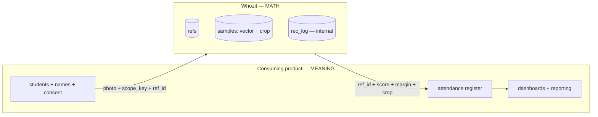
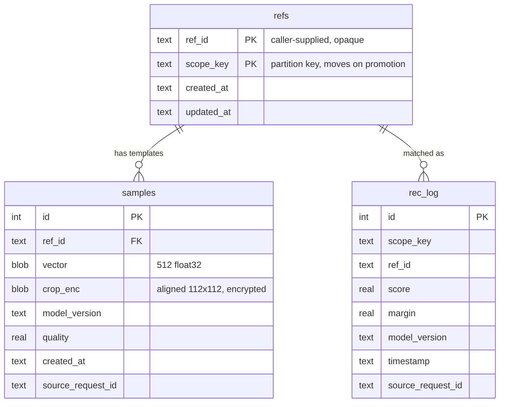

# Whozit v4 — Recognition-only component

**Author:** Shoaib Ud Din
**Date:** 2026-08-16
**Status:** Proposal — for review before implementation
**Supersedes:** the identity/attendance halves of [`docs/v3-class-scoped.md`](v3-class-scoped.md)
**Briefing deck:** [The Slug Is the Contract](https://claude.ai/code/artifact/f6b63c7c-b09b-40fb-bf32-96eea4516207) — same decisions, read-in-ten-minutes form

> Whozit is a recognition component, not an attendance product. It holds the math — face
> vectors keyed by an opaque scope string — and the consuming product holds the meaning:
> names, roster, register, dashboards.

This document records the decisions taken in a design session, why each one was taken, and
what has to change in the code. Every "what's wrong today" claim below was verified against
the source, not the docs.

---

## 1. The boundary

| Whozit owns | The consuming product owns |
| --- | --- |
| Face detection + embedding | Student names, roster, consent records |
| Face templates keyed by `(scope_key, ref_id)` | The attendance register |
| The match decision + its evidence | Dashboards, reporting, rollups |
| Enrolment crops (for model upgrades) | Resolving `ref_id` to a real child |

Whozit answers *"face 2 is your `roll-12`, score 0.71, margin 0.03"* and is never told the
outcome. It never aggregates, never reports, never learns who was present.

Two consequences to accept deliberately:

- **Whozit is blind to its own accuracy.** Ground truth is the teacher's confirmation, and
  that happens on the other side of the boundary. Score distributions are observable; error
  rate is not.
- **Whozit is not a roster backup.** If a consuming product loses its `ref_id` mapping, its
  galleries are unrecoverable and must be re-enrolled. This is a contract line, not an
  oversight.

---

## 2. What is wrong today

Verified against the current source.

### 2.1 Correctness

| # | Problem | Evidence |
| --- | --- | --- |
| C1 | **Name is the identity key, and enrolling two children with the same name in one class destroys one of them.** `enroll` falls through to a name lookup *even when a distinct `student_id` is supplied*, then does `student_id = COALESCE(?, student_id)` — overwriting the first child's external ID and appending the second child's vector to the first child's template. Duplicate first names in a Punjab classroom are the common case. | [`app/db.py:21`](../app/db.py), [`app/scoped_store.py:213-222`](../app/scoped_store.py) |
| C2 | **A student changing class has no migration path.** `class_slug` sits on the student row and nothing moves it. Annual promotion (`class-5a` → `class-6a`) therefore invalidates every gallery in the country once a year, with re-enrolment as the only recovery. The failure is silent, delayed by a year, and looks like a model regression. | [`app/db.py:14`](../app/db.py) |
| C3 | **Faces are matched independently, so one student can win several faces in one photo.** The event log dedupes by student; the response does not. The teacher sees the same child twice while the audit trail records her once. | [`app/main.py:874-915`](../app/main.py), [`app/scoped_store.py:263-265`](../app/scoped_store.py) |
| C4 | **Matching is argmax against one threshold with the runner-up discarded.** Two siblings at 0.42 and 0.40 both clear the bar; one is picked silently. Because ground truth never returns, the response is the only place ambiguity can ever be caught. | [`app/recognizer.py:133-149`](../app/recognizer.py) |
| C5 | **Multiple samples are averaged into one centroid.** Face embeddings vary widely across pose, lighting, and a year of growth; averaging across that variance pulls the centroid toward the middle of the embedding space, so adding a profile shot can make frontal matching *worse*. | [`app/scoped_store.py:52`](../app/scoped_store.py), [`app/recognizer.py:136`](../app/recognizer.py) |
| C6 | **A bad sample is permanent and undiagnosable.** `embeddings` is `(id, student_id, vector)` — no quality, no timestamp, no source. There is no API to delete one sample; only the whole student. One mis-assigned crop poisons a template forever. | [`app/db.py:27-31`](../app/db.py) |

### 2.2 Security and privacy

| # | Problem | Evidence |
| --- | --- | --- |
| S1 | **Auth is bypassed by one attacker-controlled header.** `Sec-Fetch-Site: same-origin` returns clean before the key is ever checked. `curl -H "Sec-Fetch-Site: same-origin"` is full access to every scope in the deployment — list slugs, read rosters, enrol, delete. | [`app/main.py:238`](../app/main.py) |
| S2 | **One shared key covers every scope**, and `/v3/classes` enumerates all of them. | [`app/main.py:1169-1172`](../app/main.py) |
| S3 | **Erasure is impossible.** `attendance_events` has no foreign key, so deleting a student cascades the embeddings and leaves audit rows carrying that child's identifier behind indefinitely. | [`app/db.py:35-44`](../app/db.py) |
| S4 | **A global, unscoped, name-keyed gallery still ships** alongside the scoped one. `/v1/enroll`, `/v2/recognize` and `data/people.json` have none of v3's scope discipline and are the *easier* endpoints to integrate against. | [`app/people_store.py`](../app/people_store.py) |

### 2.3 Operability

| # | Problem | Evidence |
| --- | --- | --- |
| O1 | **No `model_version` on any vector.** A backbone upgrade does not fail loudly — it matches new embeddings against old ones and returns confident garbage. | [`app/db.py:27-31`](../app/db.py) |
| O2 | **Templates cannot be regenerated.** No photos are stored, so the first model upgrade strands every gallery. | [`README.md:232`](../README.md) |
| O3 | **Per-scope gallery cache is unbounded and process-local.** It never evicts, and a second replica's enrolment is invisible to the first forever. | [`app/recognizer.py:43,62`](../app/recognizer.py) |
| O4 | **Gallery load is N+1.** One `SELECT vector` per student plus a `json.loads` of a 512-float array each. Not the index problem it looks like — `(class_slug, lower(name))` already covers the lookup — but a join-and-BLOB problem. | [`app/scoped_store.py:154-166`](../app/scoped_store.py) |
| O5 | **The default threshold `0.35` is a placeholder**, never calibrated against Punjabi or Tanzanian classroom photos. | [`app/config.py:53`](../app/config.py) |

---

## 3. Decisions

| # | Decision | Rationale |
| --- | --- | --- |
| D1 | **The register belongs to the consuming product.** Whozit does recognition only. | Aggregation rules differ per country and would otherwise become our problem. Deletes `daily_attendance` and `daily_attendance_present`. |
| D2 | **No names stored.** The caller supplies an opaque `ref_id`. | Fixes C1 at the root: `ref_id` becomes the only identity key. Also keeps identifying data away from partially-invertible vectors. |
| D3 | **The caller supplies the label; Whozit never mints an identifier.** Enrol is `(scope_key, ref_id, image)`. | Whozit minting creates a second identifier space both sides must map — and makes us the roster backup we explicitly refuse to be. |
| D4 | **Match by max over samples, not mean centroid.** Per-sample metadata; individual samples deletable; enrol returns `sample_count`. | Fixes C5 and C6. `sample_count` is the one moment where a name-as-label mistake is detectable, because caller intent and stored state are both present. |
| D5 | **Keep an identified recognition log** (`ref_id`, score, margin) with a TTL. | Chosen over de-identified metrics so a named complaint can be debugged. |
| D6 | **That log is internal only.** `GET /v3/attendance` is deleted. | A queryable per-child event log *is* a register by shape. A consuming team that finds one will use it, and the boundary erodes one convenience endpoint at a time. |
| D7 | **Store the aligned face crop next to each vector, encrypted.** | The only defence against O2. Makes a backbone upgrade a batch re-embed instead of re-photographing a country, and removes the need to run two models during a transition. |
| D8 | **Crop retention configurable per deployment, indefinite by default.** Deletion atomic across vectors, crops and log rows. Per-deployment encryption key. | A crop that expires before the template it backs is not there on the day it is needed. The per-deployment key makes program deletion a key destruction rather than a cascade you have to get right. |
| D9 | **Deployment-level isolation** — one container, volume and key per program. No `tenant_id`. | Deletes the entire class of cross-tenant leak bugs by construction rather than by careful query scoping. Also gives data residency for free. |
| D10 | **Recognise returns decision *and* evidence:** `matched`, `ref_id`, `score`, `margin`, candidates. | Fixes C4. Simple integrators read `matched`; careful ones route low-margin faces to a human. Since ground truth never returns, the response is the only place ambiguity survives. |
| D11 | **Greedy one-to-one assignment across faces in a photo.** | Fixes C3. Sort all (face, ref) pairs by score descending, assign if neither is taken. ~10 lines, no scipy. Hungarian only differs where scores cluster — exactly where `margin` already sends the face to a human. |
| D12 | **`scope_key` lives on the ref; add single and bulk move.** | Fixes C2. Promotion becomes one `UPDATE`. Covers scope renames too. |
| D13 | **Reference client rebuilt with zero persistence, deleted later.** | It must be structurally incapable of being deployed, or a program adopts it and we own an attendance product after all. |
| D14 | **One API surface.** The global name-keyed gallery is removed; a stateless detect route is kept. | Fixes S4. No external consumers exist yet, so this is cheap today and never again. |

### Rejected alternatives

| Rejected | Why |
| --- | --- |
| Store a name as an optional non-unique label | A nullable label that a UI reads is a second roster with no invalidation path across a boundary we do not control. |
| Whozit mints `ref_id` | Two identifier spaces; makes us the roster backup by the back door. |
| De-identified recognition log only | Preferred on privacy grounds, rejected because a named complaint then cannot be debugged. |
| Consuming product retains enrolment images | Unverifiable promise whose breach is discovered on upgrade day. |
| App-level multi-tenancy (`tenant_id` everywhere) | Requires permanently maintaining the code that prevents cross-program leaks; D9 removes the possibility instead. |
| Postgres now | The argument was shared writers; D9 removes sharing. SQLite + Litestream per deployment gives point-in-time recovery for the one dataset that cannot be rebuilt. |
| `memberships` table separating identity from scope | Structurally purer, but its only extra capability — one ref in several scopes — is speculative. Available later as a purely additive migration. |
| Hungarian assignment (`scipy`) | A large dependency for one function, buying optimality precisely where we have decided not to trust the machine. |

---

## 4. Target schema

Three tables, down from five. `scope_key` sits on `refs` alone — that is what makes D12's
promotion a single statement.

Deletion of a `ref_id` removes its rows in all three tables in one transaction (fixes S3).

---

## 5. API surface

| Today | Becomes |
| --- | --- |
| `POST /v1/detect` | `POST /detect` — stateless, count + crops, no identity |
| `POST /v1/enroll`, `/v2/enroll` | **deleted** |
| `GET /v1/people`, `/v2/people` | **deleted** |
| `POST /v2/recognize`, `/v2/attendance` | **deleted** |
| `POST /v3/enroll` (name, class_slug) | `POST /enroll` — `(scope_key, ref_id, image)`, returns `sample_count` |
| `POST /v3/recognize` | `POST /recognize` — returns `matched`, `ref_id`, `score`, `margin`, candidates |
| `GET /v3/people?class_slug=` | `GET /refs?scope_key=` — ref IDs only, no names |
| `DELETE /v3/people/{id}` | `DELETE /refs/{scope_key}/{ref_id}` — cascades vectors, crops, log |
| — | `DELETE /samples/{id}` — remove one bad template |
| — | `POST /refs/{scope_key}/{ref_id}/move` |
| — | `POST /scopes/{old}/move` — bulk, for annual promotion |
| `GET /v3/attendance` | **deleted** (D6) |
| `POST`/`GET /v3/attendance/day`, `/status` | **deleted** (D1) |
| `GET /v3/classes` | **deleted** — a deployment holds one program (D9) |

Auth: one strong key per deployment. The `Sec-Fetch-Site` bypass is removed outright; the
reference UI uses a short-lived session token. TLS terminated at a proxy.

---

## 6. Integration contract

These four live in the contract, not the code, because nothing in Whozit can enforce them.

1. **`ref_id` must be a stable unique ID from your system, never a display name.** Renaming it
   orphans that person's entire gallery; a collision silently corrupts a template, and Whozit
   cannot detect it because it never looks inside the string.
2. **Call the bulk move at promotion.** Skipping it silently re-enrols your whole population a
   year later and presents as a model regression.
3. **We retain enrolment crops indefinitely by default.** Your consent language must say so.
4. **The threshold is yours to calibrate,** on your own population's photos. `0.35` is a
   placeholder and nothing in this architecture will ever calibrate it for you.

Add to that the standing non-commitment: **Whozit is not a roster backup.** Lose your `ref_id`
mapping and your galleries are unrecoverable.

---

## 7. Still open

| Item | Why it matters |
| --- | --- |
| **Log TTL — an actual number** | D5 said "with a TTL". Undecided means infinite in practice. |
| **Who calibrates `0.35`, on whose photos, before which program ships** | Nothing downstream will ever produce this number for us. |
| **Quality gate on enrolment crops** | D4 adds a `quality` column but we never decided whether a poor crop is rejected or merely recorded. |
| **`README.md` and `PRD.md` are now false on photo storage** | The operator's consent language is derived from them. They must be rewritten before anyone integrates. |

---

## 8. Implementation order

Ordered by whether it is cheap now and expensive later, which is not the order of severity.

| Phase | Work |
| --- | --- |
| **P0** | Delete the `Sec-Fetch` bypass (S1). Delete v1/v2 enroll/recognize/attendance (S4, D14). Stamp `model_version` (O1). |
| **P1** | `ref_id` replaces name; drop the name-unique index (C1, D2). Store crops (D7). Per-sample metadata + `DELETE /samples/{id}` (C6, D4). Atomic delete cascade (S3). |
| **P2** | Max-over-samples matching (C5, D4). `margin` + candidates in the response (C4, D10). Greedy one-to-one assignment (C3, D11). |
| **P3** | Move endpoints, single and bulk (C2, D12). |
| **P4** | Per-deployment key + crypto-shredding (D8). Litestream (O2 durability). LRU on the gallery cache and join-and-BLOB gallery load (O3, O4). |
| **P5** | Reference client rebuilt without persistence (D13). Docs rewritten (§7). |
