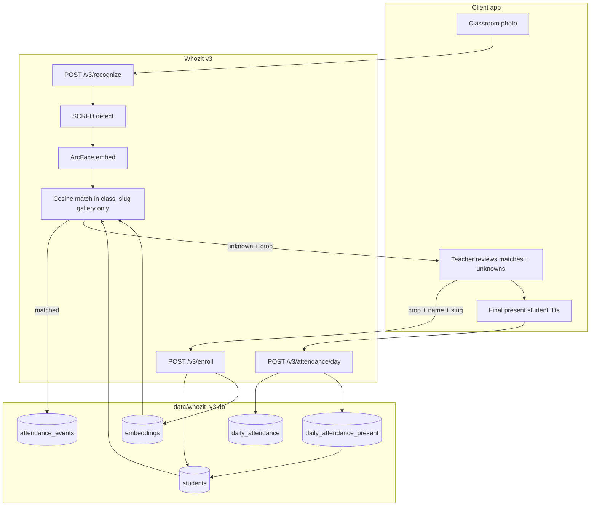

# Whozit v3 — Class-scoped recognition (SQLite)

> **Superseded by v4.** See [architecture.html](architecture.html), [proposal-by-shoaib.md](proposal-by-shoaib.md), and [README.md](../README.md). This file is kept for history.

This document explains **why v3 existed**, **how data moved**, and **which APIs were called**.

v1/v2 stay unchanged: they use a **global** JSON gallery (`data/people.json`).  
v3 uses **SQLite** (`data/whozit_v3.db`) and matches faces **only inside one class** identified by `class_slug`.

---

## Problem

Country-scale enrollment = thousands of students. Matching one photo against the whole country gallery hurts accuracy.

**Fix:** client always sends a class scope. Whozit only searches that class (~40–50 faces).

Example slug:

```text
pk/lahore-east/school-abc/class-5a
```

Meaning: country / sector / school / class. Whozit treats this as one **opaque string** (normalized lowercase). It does **not** store a separate country/sector/school table.

---

## Mental model

| Layer | What it is |
| --- | --- |
| `class_slug` | Partition key. All students + attendance for one classroom. |
| Student row | One child in one class (`students.id` = internal UUID). |
| Embeddings | One or more ArcFace vectors (512-d) per student. |
| Face events | Auto audit log when `/v3/recognize` matches a face. |
| Daily roll | Official “who was present today” — **client sends present IDs only**. |

Consent / biometric permissions are the **operator’s** responsibility. Whozit stores embeddings + attendance metadata, not raw classroom photos (uploads are processed in memory).

---

## End-to-end data flow



### Typical classroom day

1. **Enroll** (once per student, or when adding unknowns): photo + `name` + `class_slug` (+ optional `student_id`).
2. **Recognize**: photo + `class_slug` → faces identified or `unknown`. Matched faces append to `attendance_events`.
3. Teacher sees unknowns → either **discard** (do nothing) or **enroll** by re-sending the returned **crop** + name + same slug.
4. Teacher confirms attendance → **daily roll**: only the list of students who are present for that date.

Absent students are **not** stored. Client can compute absent = `GET /v3/people?class_slug=...` minus present IDs.

---

## How tables connect

```mermaid
erDiagram
  students ||--o{ embeddings : "has samples"
  students ||--o{ attendance_events : "matched as"
  daily_attendance ||--o{ daily_attendance_present : "lists present"
  students ||--o{ daily_attendance_present : "may appear on"

  students {
    text id PK
    text class_slug
    text name
    text student_id "optional external roll"
    text created_at
    text updated_at
  }

  embeddings {
    int id PK
    text student_id FK
    text vector "JSON float array 512-d"
  }

  attendance_events {
    text id PK
    text class_slug
    text student_id
    text name
    real match_score
    text timestamp
    text source_request_id
    int face_id
  }

  daily_attendance {
    text id PK
    text class_slug
    text attendance_date "YYYY-MM-DD"
    text created_at
    text updated_at
  }

  daily_attendance_present {
    text daily_id PK_FK
    text student_id PK
    text name "name snapshot"
  }
```

### Relationship summary

| From | To | Link | Meaning |
| --- | --- | --- | --- |
| `embeddings.student_id` | `students.id` | FK, **ON DELETE CASCADE** | Deleting a student removes their face vectors. |
| `attendance_events.student_id` | `students.id` | Logical (no FK) | Audit row for a recognize match; keeps name/score even if you later reason about history. |
| `daily_attendance` | `(class_slug, attendance_date)` | UNIQUE | One official roll per class per day. |
| `daily_attendance_present.daily_id` | `daily_attendance.id` | FK, **ON DELETE CASCADE** | Present rows for that day. |
| `daily_attendance_present.student_id` | `students.id` | Logical + validated on write | Must belong to the same `class_slug` or API returns 422. |

### Uniqueness rules on `students`

- Same class + same **name** (case-insensitive) → **merge** (extra embedding samples on the same row).
- Same class + same **`student_id`** (when set) → same person.
- Same name in **different** `class_slug` → **different** people (correct for country scale).

---

## Table details

### `students`

Roster of enrolled faces for a class.

| Column | Notes |
| --- | --- |
| `id` | Internal UUID. Use this in daily roll `present_student_ids`. |
| `class_slug` | Normalized scope path. |
| `name` | Display name. |
| `student_id` | Optional school roll / external ID. |
| `created_at` / `updated_at` | ISO-8601 UTC. |

### `embeddings`

Face math only (ArcFace L2-normalized vectors stored as JSON arrays). Multiple rows per student = more samples → mean embedding used at match time.

### `attendance_events`

Written automatically by `POST /v3/recognize` for **matched** faces (one event per person per request; duplicate faces of same person dedupe). This is an **audit trail**, not the official daily register.

### `daily_attendance` + `daily_attendance_present`

Official day register. `POST /v3/attendance/day` **upserts**: same class + date replaces the present list. Empty `present_student_ids` = everyone absent that day (empty present set).

---

## API surface

Auth: same as v1/v2 — if `WHOZIT_API_KEY` is set, send `X-API-Key` (or same-origin browser bypass).

| Method | Path | Role |
| --- | --- | --- |
| `POST` | `/v3/enroll` | Add/update student in a class (multipart: `image`, `name`, `class_slug`, optional `student_id`, `person_id`) |
| `GET` | `/v3/people?class_slug=` | List students in class (no embeddings in response) |
| `DELETE` | `/v3/people/{person_id}` | Delete student (+ cascade embeddings) |
| `POST` | `/v3/recognize` | Detect + match **in slug**; write face events; return faces (crops), `unknown_count`, `attendance` |
| `GET` | `/v3/attendance?class_slug=&limit=` | Face-event history |
| `POST` | `/v3/attendance/day` | JSON upsert daily present list |
| `GET` | `/v3/attendance/day?class_slug=&date=` | Read that day’s present list |
| `GET` | `/v3/attendance/day/status?class_slug=&date=` | Present + absent + `has_roll` (dashboard) |
| `GET` | `/v3/classes` | Distinct class slugs for pickers |

### Teacher + Dashboard UI

- **Teacher:** [`/teacher`](/teacher) — class → enroll → scan → unknowns → save daily roll
- **Dashboard:** [`/dashboard`](/dashboard) — class + date → present/absent, %, hit logs

### Recognize response (important fields)

- `faces[]` — each face has `matched`, `person_id`, `name`, `match_score`, and **`image_base64` crop**
- `unknown_count` — how many faces did not match
- `attendance` — face events just written for matched people
- `class_slug` — normalized slug used

**Unknown → enroll:** client POSTs the crop as `image` to `/v3/enroll` with `name` + same `class_slug`.  
**Discard unknown:** client sends nothing.

### Daily roll body

```json
{
  "class_slug": "pk/lahore-east/school-abc/class-5a",
  "date": "2026-08-13",
  "present_student_ids": ["uuid-1", "uuid-2"]
}
```

`date` is **client-owned** `YYYY-MM-DD` (your timezone). Invalid IDs or IDs from another class → **422**.

---

## Matching pipeline (inside Whozit)

1. Decode image (EXIF-aware).
2. **SCRFD** detects faces + landmarks.
3. **ArcFace** embeds each face → 512-d unit vector.
4. Load gallery = mean embedding per student **where `class_slug` matches**.
5. Cosine similarity (dot product); best score ≥ `WHOZIT_MATCH_THRESH` (default `0.35`) → matched.
6. Empty class gallery → every face is unknown (no country-wide false hits).

Gallery cache is in-memory per slug; enroll/delete for that slug invalidates it.

---

## Storage vs v1/v2

| | v1 / v2 | v3 |
| --- | --- | --- |
| DB file | `people.json`, `attendance.json` | `whozit_v3.db` |
| Scope | Global | `class_slug` |
| Env path | `WHOZIT_PEOPLE_PATH`, `WHOZIT_ATTENDANCE_PATH` | `WHOZIT_SQLITE_PATH` |
| Demo UI | Uses v1/v2 | Not wired (API only this phase) |

No automatic migration from JSON → SQLite. Dual store on purpose.

---

## Code map

| File | Job |
| --- | --- |
| [`app/db.py`](../app/db.py) | SQLite connect + schema create |
| [`app/scoped_store.py`](../app/scoped_store.py) | Enroll / list / delete / gallery / face events / daily roll |
| [`app/recognizer.py`](../app/recognizer.py) | `match()` global + `match_in_slug()` |
| [`app/main.py`](../app/main.py) | HTTP `/v3/*` routes |
| [`app/config.py`](../app/config.py) | `WHOZIT_SQLITE_PATH` |
| [`tests/test_v3_scoped.py`](../tests/test_v3_scoped.py) | Slug isolation + daily roll contracts |

---

## Curl cheat sheet

```bash
# Enroll
curl -s -X POST "http://localhost:8088/v3/enroll" \
  -F "name=Haroon" \
  -F "class_slug=pk/lahore-east/school-abc/class-5a" \
  -F "student_id=roll-12" \
  -F "image=@haroon.jpg"

# Recognize
curl -s -X POST "http://localhost:8088/v3/recognize" \
  -F "class_slug=pk/lahore-east/school-abc/class-5a" \
  -F "image=@classroom.jpg"

# Roster
curl -s "http://localhost:8088/v3/people?class_slug=pk/lahore-east/school-abc/class-5a"

# Daily present (official)
curl -s -X POST "http://localhost:8088/v3/attendance/day" \
  -H "Content-Type: application/json" \
  -d '{"class_slug":"pk/lahore-east/school-abc/class-5a","date":"2026-08-13","present_student_ids":["uuid-1","uuid-2"]}'

curl -s "http://localhost:8088/v3/attendance/day?class_slug=pk/lahore-east/school-abc/class-5a&date=2026-08-13"
```

OpenAPI live: `http://localhost:8088/docs`

---

## What v3 does **not** do (yet)

- Hierarchy admin CRUD (countries/sectors as separate tables)
- Auto-building daily roll from recognize (client owns the final present list via Teacher UI)
- FAISS / ANN (not needed at ~50 faces per class)
- Per-school API keys (one shared key scopes all slugs if set)
